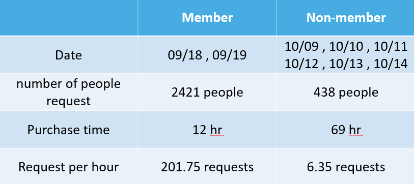

## Analyze girls generation ticket sale

Task : 

1. Please define your "system loading" measurement.
  
2. Carefully provide the details on the report slide.


Programming language and Packages : 

1. Python
  
2. pandas、numpy、matplotlib、seaborn、datetime
  

## Define the "System loading " = △ amount of people addition  / △ hr 

Data Selection :

1. "IDENTITY", "CREATE_DATE" , "T_STANDARD_TICKET_TYPE_NAME"

2. Convert "CREATE_DATE" to "newDate" & "newTIme" 

Feature Splition :

1. Split "T_STANDARD_TICKET_TYPE_NAME" to "member" & "non-member"

2. Split "CREATE_DATE" to represent the different date (ex : 0918, 0918, 1009, 1010)

Feature Combination :

1. Assume the people is the same as sample size (member = 2421 , non-member = 438)

2. Compute the at member purchase time & non-member purchase time 

3. Compute the existing buy request that each kind of different date





## Part of the description

``` python
# loading data
df = pd.read_csv("girlgenerationutf8-1.csv")

# use the CREATE_DATE column
dr = df["CREATE_DATE"]

# process CREATE_DATE : 12hr => 24hr
for index in range(len(dr)):
    t = dr.loc[index].split(" ")
    if(t[1]=="p.m."):               
        time = t[0] + " " + t[2] #去掉am pm，依照 年月日 時分秒 合併      
        dtime = datetime.strptime(time, '%Y/%m/%d %H:%M:%S.') + timedelta(hours=12)  #如果為pm 新增12小時
        dr.loc[index] = dtime
        #print(dtime)       
    else:
        time = t[0] + " " + t[2]
        dr.loc[index] = datetime.strptime(time, '%Y/%m/%d %H:%M:%S.')
```


